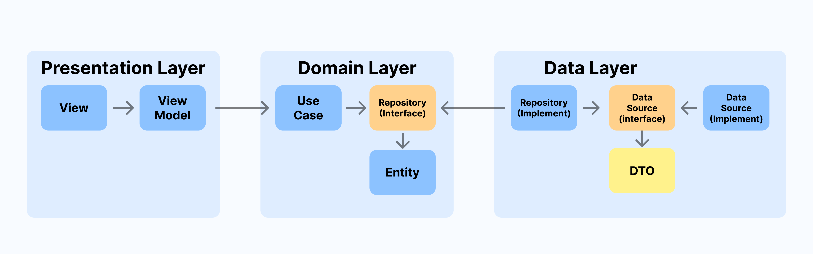

# TMDB 영화정보앱 (클린아키텍쳐)

## TODO
- Data & Domain Layer 구현
  - [X] DTO 구현 및 테스트
    - `현재 상영중` `인기순` `평점` `높은순` `개봉예정` 공통 : MovieResponseDto
    - `영화 상세` : MovieDetailDto
    - https://quicktype.io/dart
  - [X] MovieDataSource 구현 및 테스트
  - [X] Entity 구현 및 테스트
    - Movie
    - MovieDetail
  - [X] MovieRepository 구현 및 테스트
  - [X] UseCase 구현 및 테스트

- Presentation Layer 구현
  - [X] HomePage ViewModel 구현 및 테스트
  - [X] HomePage 구현
  - [ ] DetailPage ViewModel 구현 및 테스트
  - [ ] DetailPage 구현
  - [ ] HomePage -> DetailPage Hero 위젯 적용

## TMDB 요청 정보
- 요청 헤더 : { Authorization : Bearer <YOUR_TOKEN> }
- 현재 상영중 : https://api.themoviedb.org/3/movie/now_playing?language=ko-KR&page=1
- 인기순 : https://api.themoviedb.org/3/movie/popular?language=ko-KR&page=1
- 평점 높은순 : https://api.themoviedb.org/3/movie/top_rated?language=ko-KR&page=1
- 개봉 예정 : https://api.themoviedb.org/3/movie/upcoming?language=ko-KR&page=1
- 영화 상세 정보 : [https://api.themoviedb.org/3/movie/영화아이디?language=ko-KR](https://api.themoviedb.org/3/movie/1?language=ko-KR)